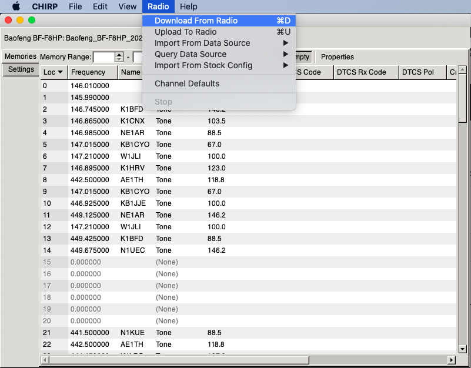
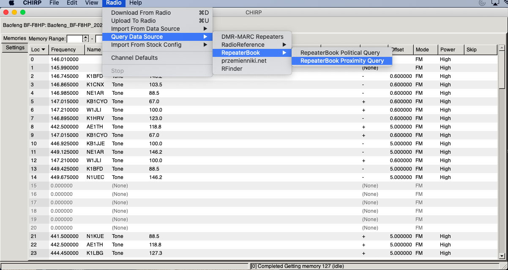
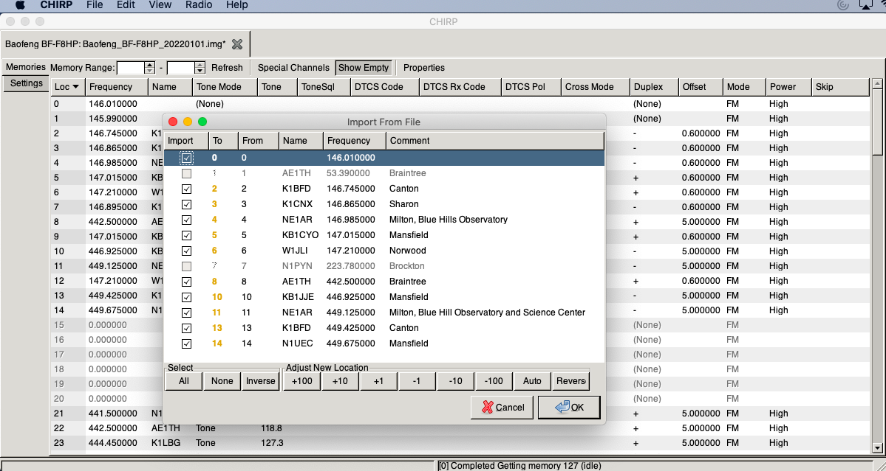

# Steps to Import Repeaters to Your Radio (Baofeng BF-F8HP)

## 1. Upload channels using CHIRP from MAC. 
Download CHIRP from the link below (MAC version) and unzip it and drag it to the `/Application` folder
https://trac.chirp.danplanet.com/chirp_daily/LATEST/

## 2. Connect the Cable to USB port of your MAC (turn the radio ON). 

## 3. Download current Channels from your Radio. 
and Save it to a file (.img extension)

## 4. Get a list of repeaters based on your city/zip-code/lat-long etc. 
and Save it to a file (.csv), edit this file if intended

## 5. Open the img file in step #3 from the Saved file path
now, from menu -> open/import the `csv` file (repeaters list saved in step #4) 

## Cable
https://amzn.to/3Jw7tBT

